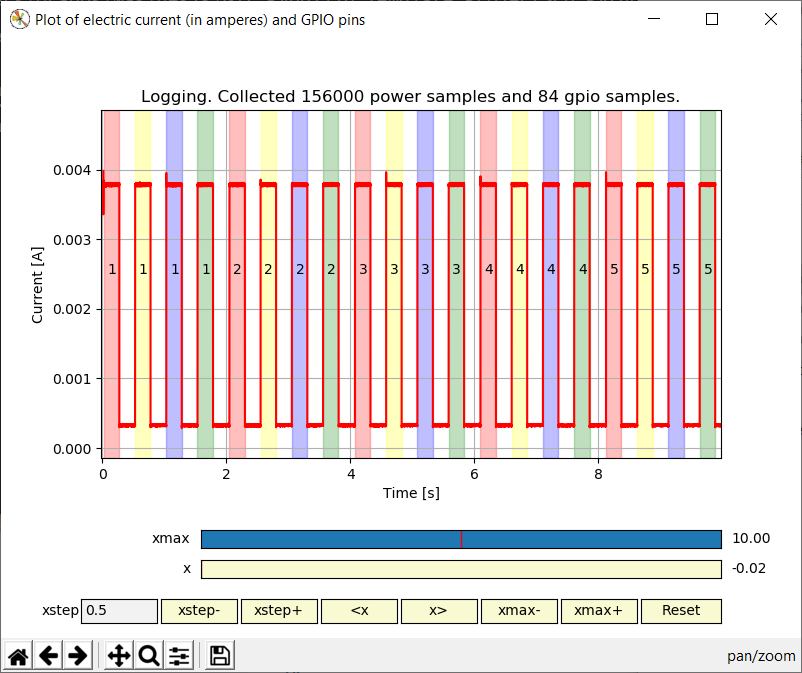

# Beginner Template Project for Pydgilib

## Table of Contents

1. [Requirements & Installation](#requirements-&-installation)
    
    1.1. [Step 1: General requirements](#step-1:-general-requirements)
    
    1.2. [Step 2: `pipenv` environments initialization](#step-2:-`pipenv`-environments-initialization)

    1.3. [Step 3: Jupyter Lab installation](#step-3:-jupyter-notebook-installation)

2. [Tutorial](#tutorial)

3. [Folder structure](#folder-structure)

4. [Remarks](#remarks)

5. [Collaboration tools](#collaboration-tools)

6. [TODO](#TODO)

## Requirements & Installation

### Step 1: General requirements

Windows is required. Linux is optional, but can be used.

In Windows, the following are required to be installed by you:

- [Python 3.7+ 64-bit](https://www.python.org/downloads/): Can be installed in
  `C:\Python37`. _**Can be a good idea to add this version of Python to Windows'
  PATH.**_

- [Python 3.7+ 32-bit](https://www.python.org/downloads/): Can be installed in
  `C:\Python37-32\`. _This version of Python should not be added to Windows'
  PATH._

- Python `pip` for the Python 3.7+ 64 bit: On Windows it appears as an
  selectable feature to install during Python's installation, when using the
  _Customize installation_ option. Make sure it is checked.

- `pipenv`: Can be installed by opening a command line window in Windows and
  writing `pip install pipenv`.

If using Linux, the following would be required:

- Python 3.7+ 64-bit: On Ubuntu, run `sudo apt-get install python3` in the
  terminal. On ArchLinux, run `sudo pacman -S python3`.

- Python `pip`: On Ubuntu, run `sudo apt-get install python3-pip`. On
  ArchLinux, run `sudo pacman -S python-pip`.

- `pipenv`: Either on Ubuntu or on ArchLinux, run
  either `sudo pip install pipenv` or just `pip install pipenv` in the terminal.

Linux is not be able to interact
with the 32-bit only `dgilib.dll` and connect to the board, in order to do
measurements. Therefore, it does not need the 32-bit Python installed.

### Step 2: `pipenv` environments initialization

Considering `.` is the location of the cloned repo, then:

- On Windows, run `pipenv install --python C:\Python36-32\python.exe` inside
  the `./Python/Experiments` folder.

  - `C:\Python36-32` needs to be changed to the
    proper path where you installed the 32-bit Python.

  - This makes `pipenv` use 32-bit Python when inside the `Experiments` folder,
    instead of the default 64-bit Python.

  - _Optionally:_ You can easily use
    `open_cmd_administrator.cmd`, which is at the root of the repo, in order
    to open a command line with administrator privileges before doing this.

- On both Linux (if used) and Windows, also simply run `pipenv install` inside
  the `./Python/Plots` folder. This should automatically make `pipenv` use the
  64-bit Python version for this folder (especially on Windows, if you properly
  _only_ added 64-bit Python to path, as instructed in the
  [Requirements](#requirements) section).

### Step 3: Jupyter Lab installation

If you are going to use Jupyter Lab, then a suggestion is to  install it as a main package on your computer, separate from the `pipenv` Python environments established for this project.

* On either Windows or Linux, run `pip install jupyterlab`.

In order to use the newly made Python environment in the `./Python/Plots` folder, then:

* On either Windows or Linux, run `pipenv shell` inside `./Python/Plots`

* Then, run `python -m ipykernel install --user --name=my-virtualenv-name`, where `my-virtualenv-name` can be whatever name you want to distinguish the Python environment in the Jupyter Lab kernel list menu

## Tutorial

### Running experiments

After everything is setup:

* On Windows, in the root directory of the repo `.`, you can run the `run_experiments.cmd` batch script. You can also do what the script does by yourself, if you want:

  * Go to `./Python/Experiments`

  * Run `pipenv shell` in a command window

  * Run `python experiments.py` in the same command window

* If it worked, a plot as shown below should pop up and populate itself:

  

## Folder structure

The reason the Python scripts are put in separate folders is because some of
them will use the 32-bit Python version only, in order to interact with
`dgilib.dll` (which comes only in a 32-bit format). Other scripts will use
64-bit Python to overcome a well known limitation of processes on Windows
and Linux being able to use only up to 2GB of RAM when running as 32-bit, even
when running on 64-bit OSes ([1], [2]).

There are `Pipfile`-s in both folders to ease the installation of packages
using `pipenv`, for the two different Python versions of different
architectures.

[1]: https://en.wikipedia.org/wiki/2_GB_limit

[2]: https://docs.microsoft.com/en-us/windows/win32/memory/memory-limits-for-windows-releases

## Remarks

- The `pipenv` environments get installed by default in the `C:\Users\[Your Username]\.virtualenvs` directory on Windows and in `/home/[your username]/.virtualenvs`
  on Linux. Sometimes, more environments than needed are getting initialized,
  they then remain abandoned and consume unnecessary space. You can visit the
  aforementioned paths and delete the discarded environments manually to save
  space. Usually, you confirm the environments that are indeed used by
  checking their ID, that is shown when you executed `pipenv shell` in
  the terminal in the corresponding folder (in our case, being either
  `./Python/Experiments` or `./Python/Plots`).

## Collaboration tools

As probably, if you're using Linux, you would want to have 2 computers - one
for working with the Pydgilib library on Windows and one for using Linux and
doing data processing - the following software is recommended for ease of use
when using two computers at a time:

- [Barrier](https://github.com/debauchee/barrier)
- [SyncTrayzor](https://github.com/canton7/SyncTrayzor) for Windows /
  [Syncthing](https://syncthing.net/) for Linux

## TODO

**Project itself**

- [x] Expose color selection for gpio pins

- [x] Keep plot window from closing

- [x] Expose delay setting

- [x] LED test

- [ ] Serial test

**Library**

- [x] Fix title of plot (by exposing title option in the example project hereș will probably repair in library repo later)

**README**

- [x] Write [Requirements](#requirements)
